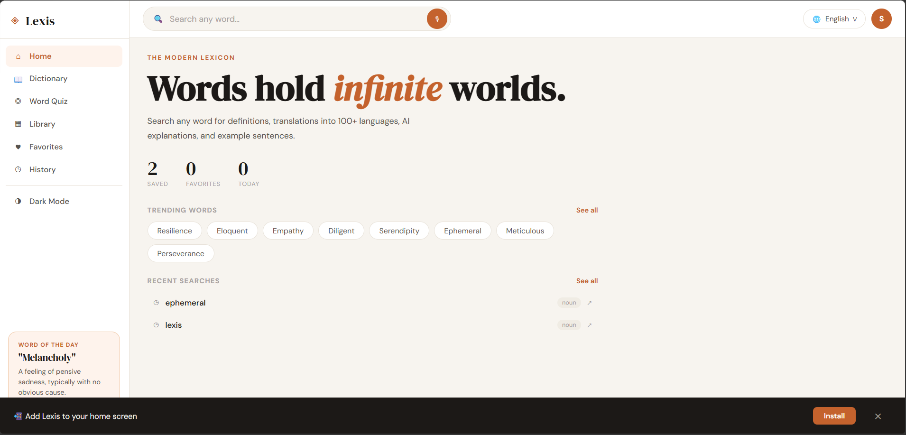
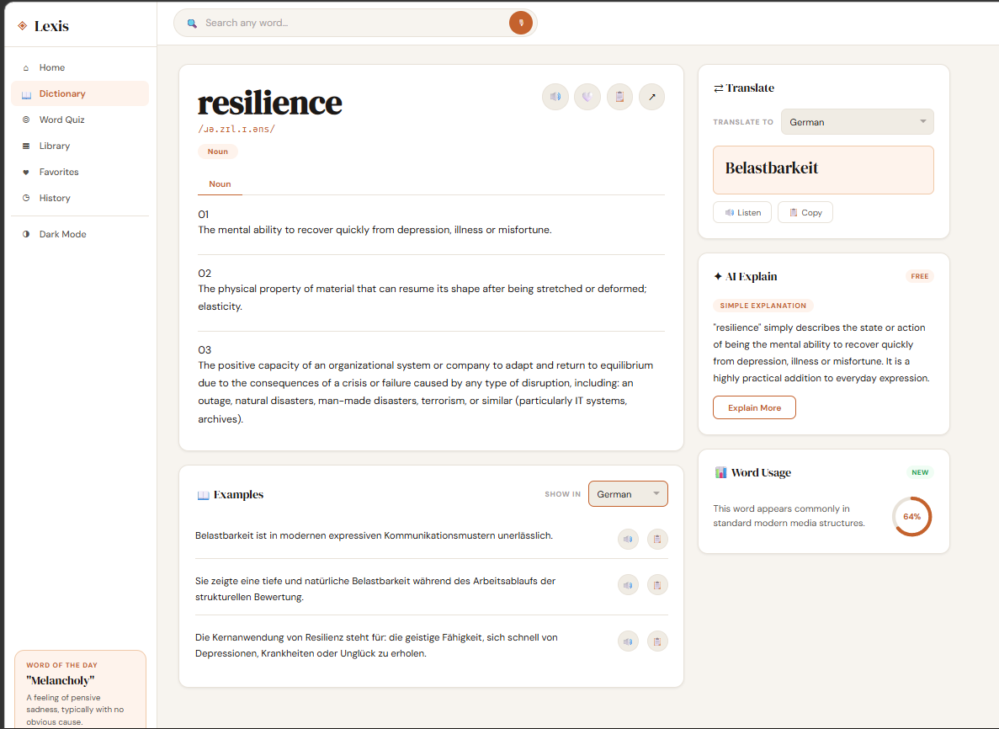
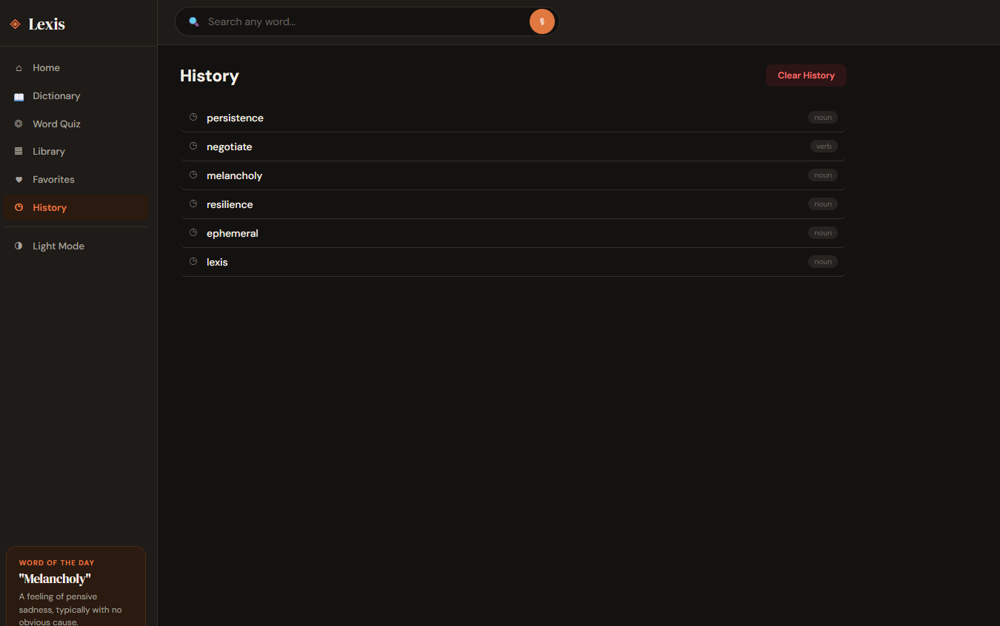
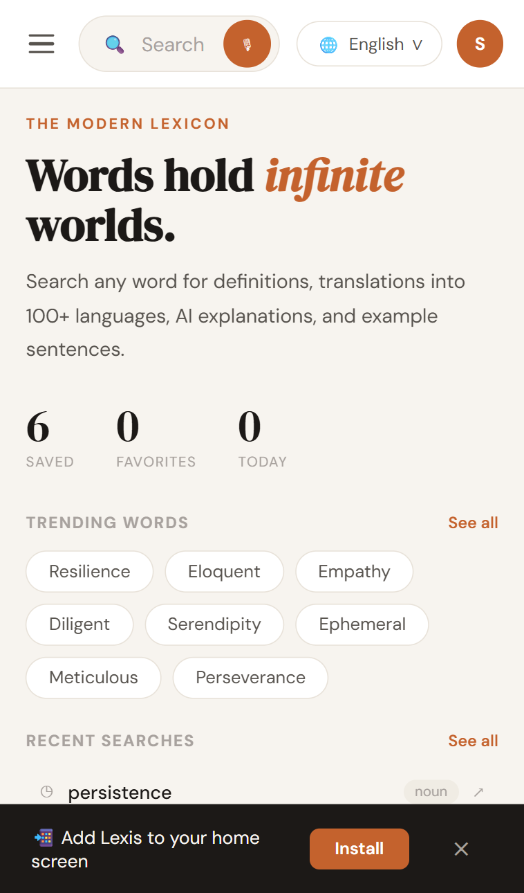
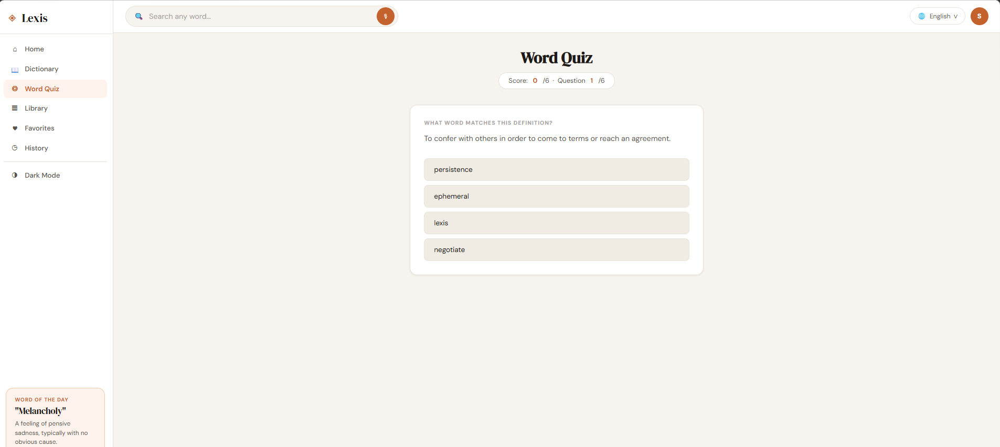

# Lexis — AI-Powered Dictionary & Language Learning Platform

> A modern, feature-rich dictionary and multilingual translator built as a Progressive Web App

[](https://lexis-dictionary.netlify.app)
[](https://lexis-dictionary.netlify.app)
[](LICENSE)
[]()
[]()
[]()

---

## 🔗 Links

| | |
|---|---|
| 🌐 **Live Demo** | [https://lexis-dictionary.netlify.app](https://lexis-dictionary.netlify.app) |
| 💻 **Repository** | [https://github.com/sugumaranchris/lexis](https://github.com/sugumaranchris/lexis) |

---

## 📸 Screenshots

### Desktop — Home


### Desktop — Dictionary


### Desktop — Dark Mode


### Mobile UI


### Word Quiz



---

## ✨ Features

| Feature | Status |
|---------|--------|
| 📖 Dictionary lookup with definitions, phonetics, part of speech | ✅ Complete |
| 🔊 Audio pronunciation + text-to-speech fallback | ✅ Complete |
| 🤖 AI-powered word explanations | ✅ Complete |
| 📝 Example sentences with word highlighting | ✅ Complete |
| 📊 Word usage frequency indicator | ✅ Complete |
| 🎯 Vocabulary quiz from saved words | ✅ Complete |
| 💾 Library — save and organize words | ✅ Complete |
| ❤️ Favorites — mark and filter favorite words | ✅ Complete |
| 🕐 Search history | ✅ Complete |
| 🌟 Word of the Day | ✅ Complete |
| 🎙️ Voice search via Web Speech API | ✅ Complete |
| 🌙 Dark / Light mode toggle | ✅ Complete |
| 📲 PWA — installable on Android, iOS, Windows, macOS | ✅ Complete |
| 📴 Offline support via Service Worker | ✅ Complete |
| 🌍 Multilingual translation (60+ languages) | 🚧 In Progress |
| 📱 Play Store release | 🚧 In Progress |
| 🔔 Daily Word of the Day push notifications | 📋 Planned |
| ☁️ User accounts and cloud sync | 📋 Planned |

---

## 🛠 Tech Stack

| Technology | Purpose |
|------------|---------|
| HTML5 | Structure, PWA manifest |
| CSS3 | Styling, animations, responsive layout, dark mode |
| Vanilla JavaScript (ES6+) | All app logic — no frameworks |
| Service Worker | Offline caching and PWA install |
| Web Speech API | Voice search and text-to-speech |
| Free Dictionary API | Word definitions and phonetics |
| MyMemory Translation API | Multilingual translation |
| Cloudflare Workers | Translation proxy backend |
| Google Fonts | DM Serif Display & DM Sans typography |
| Netlify | Hosting and deployment |

---

## 🚀 Getting Started

### Run locally

```bash
# Clone the repository
git clone https://github.com/sugumaranchris/lexis.git

# Enter the project folder
cd lexis

# Open with VS Code Live Server
# Right-click index.html → "Open with Live Server"
```

No build tools. No npm install. No configuration. It just works.

### Project structure

```
lexis/
├── index.html        # App shell and all page views
├── style.css         # All styles, themes, responsive layout
├── script.js         # All app logic
├── manifest.json     # PWA manifest
├── sw.js             # Service Worker (offline support)
├── worker.js         # Cloudflare Worker (translation backend)
├── icon-192.png      # App icon 192x192
├── icon-512.png      # App icon 512x512
└── screenshots/      # App screenshots
```

---

## 🗺️ Roadmap

- [x] Dictionary lookup with full definitions and phonetics
- [x] Audio pronunciation
- [x] AI-powered word explanations
- [x] Example sentences
- [x] Word usage frequency
- [x] Vocabulary quiz
- [x] Favorites and Library
- [x] Search History
- [x] Dark Mode
- [x] Voice Search
- [x] PWA — installable on all platforms
- [x] Offline support
- [x] Deployed on Netlify
- [ ] Multilingual translation — stable across all networks
- [ ] Play Store release
- [ ] Microsoft Store release
- [ ] Daily Word of the Day push notifications
- [ ] User accounts and cloud sync
- [ ] Offline dictionary (local word cache)
- [ ] CEFR difficulty ratings
- [ ] Word etymology and origin
- [ ] Flashcard study mode

---

## 📱 Install as App

Lexis is a Progressive Web App — install it directly from your browser:

- **Android** — Chrome → menu → "Add to Home Screen"
- **iOS** — Safari → Share → "Add to Home Screen"
- **Windows / Mac** — Chrome or Edge → install icon in address bar

---

## 👨‍💻 Author

**Sugumaran S.**
B.E. Computer Science & Engineering
RRASE College of Engineering (Anna University affiliated)

- GitHub: [@sugumaranchris](https://github.com/sugumaranchris)
- Live Project: [lexis-dictionary.netlify.app](https://lexis-dictionary.netlify.app)

---

## 📄 License

This project is licensed under the [MIT License](LICENSE).

---

## 🙏 Acknowledgements

- [Free Dictionary API](https://dictionaryapi.dev/) — Word definitions and phonetics
- [MyMemory Translation API](https://mymemory.translated.net/) — Translation service
- [Google Fonts](https://fonts.google.com/) — Typography
- [Netlify](https://netlify.com/) — Hosting and deployment

---

**If you found this useful, please star the repository!**

*Made with love by Sugumaran S.*
